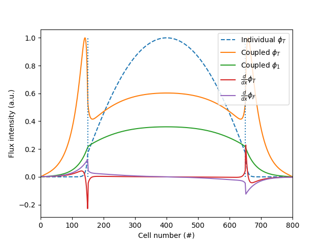
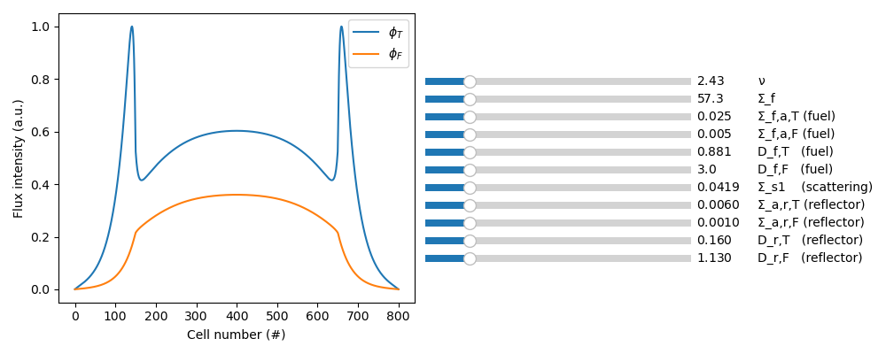

# Reflector Peaks Simulation
Basic simulation of a nuclear reactor core as a two-groups, 1D, infinite slab with reflectors, aimed at showing the existence of reflector peaks.

Implemented in python with finite difference methods and customizable with 11 parameters.

## Installation
1. Install python, conda, and mamba according to existing online guides
1. Create a mamba virtual environment with the given configuration file:

        ```mamba create -n ERP_sym -f ERP_mamba_config.yml```

        ```mamba activate ERP_sym```


1. Configure VS Code or your preferred code editor to support Jupyter notebooks
1. Run each cell and play around with the parameters!

## Examples
### Default Simulation Output


### Interactive Playground

